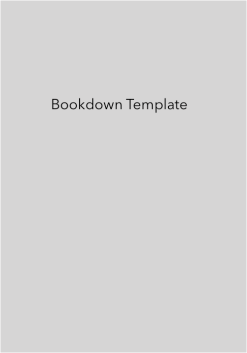

--- 
title: "Bookdown Template"
author: "Jerid Francom"
date: "Latest version: `r format(Sys.Date(), '%B %d, %Y')`"
site: bookdown::bookdown_site
output: bookdown::gitbook
documentclass: book
bibliography: [latex/book.bib, latex/packages.bib]
biblio-style: apalike
link-citations: yes
csl: /Users/francojc/Documents/Styles/apa-no-doi-no-issue.csl
github-repo: francojc/
cover-image: "images/cover.png"
description: "This is a minimal example of using the bookdown package to write a book. The output format for this example is bookdown::gitbook."
---

# Preface {-}

```{r cover, echo=FALSE, out.width='50%'}

```

```{r meta-setup, echo=FALSE}
initGlossary() # main
initTaxonomy(type = "tags")
```

## Overview {-}

This is a _sample_ book written in **Markdown**. You can use anything that Pandoc's Markdown supports, e.g., a math equation $a^2 + b^2 = c^2$.

The **bookdown** package can be installed from CRAN or Github:

```{r eval=FALSE}
install.packages("bookdown")
# or the development version
# devtools::install_github("rstudio/bookdown")
```

Remember each Rmd file contains one and only one chapter, and a chapter is defined by the first-level heading `#`.

To compile this example to PDF, you need XeLaTeX. You are recommended to install TinyTeX (which includes XeLaTeX): <https://yihui.name/tinytex/>.

## Helpful tips {-}

1. I've added a `setup.R` script in the '_bookdown.yml' file to run before each chapter (as each chapter starts neew). I've also loaded some key libraries and set some general options for code chunks and figures. 
2. You can run the `bookdown::serve_book()` function to set up a live preview situation. 

```{r include=FALSE}
# automatically create a bib database for R packages
knitr::write_bib(c(
  .packages(), 'bookdown', 'knitr', 'rmarkdown', 'tidyverse'
), 'latex/packages.bib')
```
